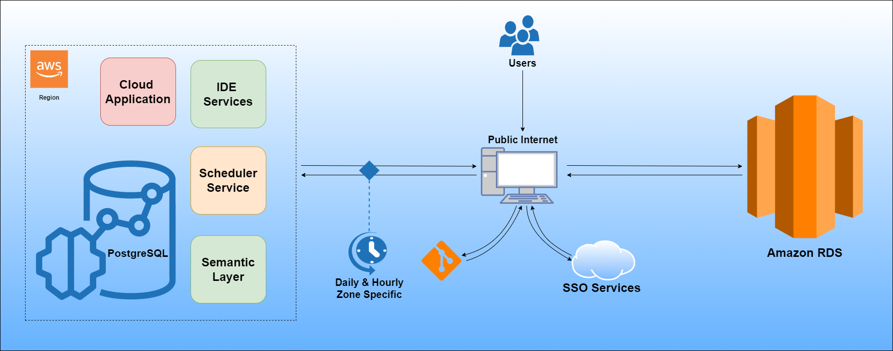

# **Improve the availability of Operational and Regulatory Information, which inspires high levels of scalability and performance with AWS Cloud.** :computer: #

The purpose of this project was to create a Web Application where all the concerned teams can find the right information related to their Operational and Regulatory Information.

## > :rocket: **Thank you for your interest in my work.** :blush: ##

This solution aims at deploying a web application with a PostgreSQL database on AWS in 3 environments (Development, Staging, & Production).

The project is supported by several managed services including AWS RDS, PostgreSQL,Amazon ElastiCache, Amazon Elasticsearch Service, Amazon Pinpoint and Amazon Personalize.

# **Web App Optimization** :hourglass_flowing_sand::clock10: #

### ✔️ Problem Statement ###

We faced 3 different issues, that might have highly similar root causes:

1. Finished Operational Test Results Required, is sent to the officials with wrong denomination of the destination country or the subjects to be declared free from or to be tested.
2. Shipment documentation does not match with country requirements.
3. Bag print or layout is not in line with the country's request.

On the Regulatory Document, we did not have a tool. On the transport documentation we had a tool, however, we faced accuracy issues with it. In case of the bag print, a project was pulled together but still some countries were kept out of scope.

In a similar case, few regulatory information were recorded from Jan 2020, but we knew that, not all the cases were registered and they were only reported by emails.

#### ✔️ Objectives ####

Create a highly scalable Web App with a distributed relational database, where all the concerned teams can find the right information related to the Regulatory information to request, bag layout, and the transport documentation. All the information needed to be related to the Initial Article Number and it must have been able to track when the changes were done.

#### ✔️ Scope ####

**1st Phase:** 2 Commercial Crops

**2nd Phase:** Include Other Crops

**Not In Scope:** NA

#### ✔️ Deliverables ####

1. Flow Process: AS IS
2. Flow Process: Future State
3. Web Interface Tool Accessible for all Stakeholders
4. Clear Roles in the Process - DACI

#### ✔️ Critical Success Factors ####

1. Management of Change.
2. Countries Ownership of the Process.
3. Good Application from the database to the Production Sites.

#### ✔️ Measures: KPIs & Benefits ####

1. Non-conformities due to wrong delivery documentation.
2. Waiting time for Regulatory Document Corrections.
3. Bag printing issues and financial consequences (rework, manual relabeling, etc.).

#### ✔️ Issues and Risks ####

- Input collection accuracy and in-time records.

# **Key considerations when using AWS for Web Hosting** :unlock: #

There are some key differences between the AWS Cloud and a traditional web application hosting model. This section points out some of the key architectural shifts that you need to consider when you bring any application into the cloud.

1. **No more physical network appliances** - You cannot deploy physical network appliances in AWS. For example, firewalls, routers, and load balancers for your AWS applications can no longer reside on physical devices, but must be replaced with software solutions. There is a wide variety of enterprise-quality software solutions, whether for load balancing or establishing a VPN connection. This is not a limitation of what can be run on the AWS Cloud, but it is an architectural change to your application if you use these devices today.

2. **Firewalls everywhere** - Where you once had a simple demilitarized zone (DMZ) and then open communications among your hosts in a traditional hosting model, AWS enforces a more secure model, in which every host is locked down. One of the steps in planning an AWS deployment is the analysis of traffic between hosts. This analysis will guide decisions on exactly what ports need to be opened. You can create security groups for each type of host in your architecture. You can also create a large variety of simple and tiered security models to enable the minimum access among hosts within your architecture. The use of network access control lists within Amazon VPC can help lock down your network at the subnet level.

3. **Consider the availability of multiple data centers** - Think of Availability Zones within an AWS Region as multiple data centers. EC2 instances in different Availability Zones are both logically and physically separated, and they provide an easy-to-use model for deploying your application across data centers for both high availability and reliability. Amazon VPC as a Regional service enables you to leverage Availability Zones while keeping all of your resources in the same logical network.

4. **Treat hosts as ephemeral and dynamic** - Probably the most important shift in how you might architect your AWS application is that Amazon EC2 hosts should be considered ephemeral and dynamic. Any application built for the AWS Cloud should not assume that a host will always be available and should be designed with the knowledge that any data in the EC2 instant stores will be lost if an EC2 instance fails.

When a new host is brought up, you shouldn’t make assumptions about the IP address or location within an Availability Zone of the host. Your configuration model must be flexible, and your approach to bootstrapping a host must take the dynamic nature of the cloud into account. These techniques are critical for building and running a highly scalable and fault-tolerant application.

##  **Initiation: Data Flow** :blue_book: ##

**Web App Data Flow**

<p align="center">
  
</p>
<p align="center"><b>Scenario 1:</b> The Web App Data Flow.</p>

#  **Architecture: AWS Cloud** :cloud: #

## **Project Plan** :black_nib: ##

<p align="center">
  
</p>
<p align="center"><b>Scenario 2:</b> The Project Plan - AWS Cloud.</p>

## **Architecture Design - 3 Tier Single Region** :thought_balloon: ##

The following figure provides a look at the classic web application architecture and how it can leverage the AWS Cloud computing infrastructure.

<p align="center">
  
</p>
<p align="center"><b>Scenario 3:</b> The Architecture Design - 3 Tier Single Region.</p>

*System Overview:*

1. **DNS services with Amazon Route 53** – Provides DNS services to simplify domain management.

2. **Edge caching with Amazon CloudFront** – Edge caches high-volume content to decrease the latency to customers.

3. **Edge security for Amazon CloudFront with AWS WAF** – Filters malicious traffic, including cross site scripting (XSS) and SQL injection via customer-defined rules.

4. **Load balancing with Elastic Load Balancing (ELB)** – Enables you to spread load across multiple Availability Zones and AWS Auto Scaling groups for redundancy and decoupling of services.

5. **DDoS protection with AWS Shield** – Safeguards your infrastructure against the most common network and transport layer DDoS attacks automatically.

6. **Firewalls with security groups** – Moves security to the instance to provide a stateful, host-level firewall for both web and application servers.

7. **Caching with Amazon ElastiCache** – Provides caching services with Redis or Memcached to remove load from the app and database, and lower latency for frequent requests.

8. **Managed database with Amazon Relational Database Service (Amazon RDS)** – Creates a highly available, multi-AZ database architecture with six possible DB engines.

9. **Static storage and backups with Amazon Simple Storage Service (Amazon S3)** – Enables simple HTTP-based object storage for backups and static assets like images and video.

### **Key components of an AWS Web Hosting Architecture** :key: ###

The following sections outline some of the key components of a web hosting architecture deployed in the AWS Cloud, and explain how they differ from a traditional web hosting architecture.

1. **Network management** - In the AWS Cloud, the ability to segment your network from that of other customers enables a more secure and scalable architecture. While security groups provide host-level security, Amazon Virtual Private Cloud (Amazon VPC) enables you to launch resources in a logically isolated and virtual network that you define.

Amazon VPC is a service that gives you full control over the details of your networking setup in AWS. Examples of this control include creating public-facing subnets for web servers, and private subnets with no internet access for your databases. Additionally, Amazon VPC enables you to create hybrid architectures by using hardware virtual private networks (VPNs), and use the AWS Cloud as an extension of your own data center.

Amazon VPC also includes IPv6 support in addition to traditional IPv4 support for your network.

2. **Content delivery** - When your web traffic is geo-dispersed, it’s not always feasible and certainly not cost effective to replicate your entire infrastructure across the globe. A Content Delivery Network (CDN) provides you the ability to utilize its global network of edge locations to deliver a cached copy of web content such as videos, webpages, images and so on to your customers. To reduce response time, the CDN utilizes the nearest edge location to the customer or originating request location to reduce the response time. Throughput is dramatically increased given that the web assets are delivered from cache. For dynamic data, many CDNs can be configured to retrieve data from the origin servers.

You can use CloudFront to deliver your website, including dynamic, static, and streaming content, using a global network of edge locations. CloudFront automatically routes requests for your content to the nearest edge location, so content is delivered with the best possible performance. CloudFront is optimized to work with other AWS services, like Amazon S3 and Amazon Elastic Compute Cloud (Amazon EC2). CloudFront also works seamlessly with any origin server that is not an AWS origin server, which stores the original, definitive versions of your files.

Like other AWS services, there are no contracts or monthly commitments for using CloudFront – you pay only for as much or as little content as you actually deliver through the service.

Additionally, any existing solutions for edge caching in your web application infrastructure should work well in the AWS Cloud.

3. **Managing public DNS** - Moving a web application to the AWS Cloud requires some Domain Name System (DNS) changes. To help you manage DNS routing, AWS provides Amazon Route 53, a highly available and scalable cloud DNS web service. Route 53 is designed to give developers and businesses an extremely reliable and cost-effective way to route end users to internet applications by translating names such as “www.example.com” into numeric IP addresses such as 192.0.2.1, that computers use to connect to each other. Route 53 is fully compliant with IPv6 as well.

4. **Host security** - In addition to inbound network traffic filtering at the edge, AWS also recommends web applications apply network traffic filtering at the host level. Amazon EC2 provides a feature named security groups. A security group is analogous to an inbound network firewall, for which you can specify the protocols, ports, and source IP ranges that are allowed to reach your EC2 instances.

You can assign one or more security groups to each EC2 instance. Each security group allows appropriate traffic in to each instance. Security groups can be configured so that only specific subnets, IP addresses, and resources have access to an EC2 instance. Alternatively, they can reference other security groups to limit access to EC2 instances that are in specific groups.

In the above architecture, the security group for the web server cluster might allow access only from the web-layer Load Balancer and only over TCP on ports 80 and 443 (HTTP and HTTPS). The application server security group, on the other hand, might allow access only from the application-layer Load Balancer. In this model, your support engineers would also need to access the EC2 instances, what can be achieved with AWS Systems Manager Session Manager.

5. **Load balancing across clusters** - Hardware load balancers are a common network appliance used in traditional web application architectures. AWS provides this capability through the Elastic Load Balancing (ELB) service. ELB automatically distributes incoming application traffic across multiple targets, such as EC2 instances, containers, IP addresses, AWS Lambda functions, and virtual appliances. It can handle the varying load of your application traffic in a single Availability Zone or across multiple Availability Zones. Elastic Load Balancing offers four types of load balancers that all feature the high availability, automatic scaling, and robust security necessary to make your applications fault tolerant.

6. **Finding other hosts and services** - In the traditional web hosting architecture, most of your hosts have static IP addresses. In the AWS Cloud, most of your hosts have dynamic IP addresses. Although every EC2 instance can have both public and private DNS entries and will be addressable over the internet, the DNS entries and the IP addresses are assigned dynamically when you launch the instance. They cannot be manually assigned. Static IP addresses (Elastic IP addresses in AWS terminology) can be assigned to running instances after they are launched. You should use Elastic IP addresses for instances and services that require consistent endpoints, such as primary databases, central file servers, and EC2-hosted load balancers.

7. **Caching within the web application** - In-memory application caches can reduce load on services and improve performance and scalability on the database tier by caching frequently used information. Amazon ElastiCache is a web service that makes it easy to deploy, operate, and scale an in-memory cache in the cloud. You can configure the in-memory cache you create to automatically scale with load and to automatically replace failed nodes. ElastiCache is protocol-compliant with Memcached and Redis, which simplifies migration from your current on-premises solution.

## **Architecture Design - 3 Tier Multi Region** :thought_balloon: ##

### **Considerations before getting started** ###

AWS Regions are built with multiple isolated and physically separate Availability Zones (AZs). This approach allows you to create highly available Well-Architected workloads that span AZs to achieve greater fault tolerance. This satisfies the availability goals for most applications, but there are some general reasons that you may be thinking about expanding beyond a single Region:

1. **Expansion to a global audience** as an application grows and its user base becomes more geographically dispersed, there can be a need to reduce latencies for different parts of the world.
2. **Reducing** Recovery Point Objectives (RPO) and Recovery Time Objectives (RTO) as part of a multi-Region disaster recovery (DR) plan.
3. **Local laws and regulations** may have strict data residency and privacy requirements that must be followed.

If you’re building a new multi-Region application, you may want to consider focusing on AWS services that have built-in functionality to assist. Existing applications will need to be further examined to determine the most expandable architecture to support its growth. The following sections review these services, and highlight use cases and best practices.

### **Application Management and Monitoring** ###

1. **Developer tools** - Automation that uses infrastructure as code (IaC) removes manual steps to create and configure infrastructure. It offers a repeatable template that can deploy consistent environments in different Regions.

IaC with AWS CloudFormation StackSets uses a single template to create, update, and delete stacks across multiple accounts and Regions in a single operation. When writing an AWS CloudFormation template, you can change the deployment behavior by pairing parameters with conditional logic. For example, you can set a “standby” parameter that, when “true,” limits the number of Amazon Elastic Compute Cloud (Amazon EC2) instances in an Amazon EC2 Auto Scaling group deployed to a standby Region.

Applications with deployments that span multiple Regions can use cross-Region actions in AWS CodePipeline for a consistent release pipeline. This way you won’t need to set up different actions in each Region. EC2 Image Builder and Amazon Elastic Container Registry (Amazon ECR) have cross-Region copy features to help with consistent AMI and image deployments.

2. **Event-driven architecture** - Decoupled, event-driven applications produce a more extensible and maintainable architecture by having each component perform its specific task independently.

Amazon EventBridge, a serverless event bus, can send events between AWS resources. By utilizing cross-Region event routing, you can share events between workloads in different Regions and accounts. For example, you can share health and utilization events across Regions to determine which Regional workload deployment is best suited for requests.

If your event-driven application relies on pub/sub messaging, Amazon Simple Notification Service (Amazon SNS) can fan out to multiple destinations. When the destination targets are Amazon Simple Queue Service (Amazon SQS) queues or AWS Lambda functions, Amazon SNS can notify recipients in different Regions. For example, you can send messages to a central SQS queue that processes orders for a multi-Region application.

3. **Monitoring and observability** - Observability becomes even more important as the number of resources and deployment locations increases. Being able to quickly identify the impact and root cause of an issue will influence recovery activities, and ensuring your observability stack is resilient to failures will help you make these decisions. When building on AWS, you can pair the health of AWS services with your application metrics to obtain a more complete view of the health of your infrastructure.

To maintain visibility over an application deployed across multiple Regions and accounts, you can create a Trusted Advisor dashboard and an operations dashboard with AWS Systems Manager Explorer. The operations dashboard offers a unified view of resources, such as Amazon EC2, Amazon CloudWatch, and AWS Config data. You can combine the metadata with Amazon Athena to create a multi-Region and multi-account inventory view of resources.

You can view metrics from applications and resources deployed across multiple Regions in the CloudWatch console. This makes it easy to create graphs and dashboards for multi-Region applications. Cross-account functionality is also available in CloudWatch, so you can create a centralized view of dashboards, alarms, and metrics across your organization.

4. **Management: Governance** - Growing an application into a new country means there may be additional data privacy laws and regulations to follow. These will vary depending on the country, and we encourage you to investigate with your legal team to fully understand how this affects your application.

AWS Control Tower supports data compliance by providing guardrails to control and meet data residency requirements. These guardrails are a collection of Service Control Policies (SCPs) and AWS Config rules. You can implement them independently of AWS Control Tower if needed.

5. **Management: Operations** - Several AWS Systems Manager capabilities allow for easier administration of AWS resources, especially as applications grow. Systems Manager Automation simplifies common maintenance and deployment tasks for AWS resources with automated runbooks. These runbooks automate actions on resources across Regions and accounts. You can pair Systems Manager Automation with Systems Manager Patch Manager to ensure instances maintain the latest patches across accounts and Regions.

6. **Bringing it together** - At the end of each part of this blog series, I actually built on a sample application based on the services covered. This shows us how to bring these services together to build a multi-Region application with AWS services. I did not use every service mentioned, just those that fit the use case.

I built this example to expand to a global audience. It requires high availability across Regions, and favors performance over strict consistency. I have chosen the following services covered in this post to accomplish our goals:

- CloudFormation StackSets to deploy everything with IaC. This ensures the infrastructure is deployed consistently across Regions.
- AWS Config rules provide a centralized place to monitor, record, and evaluate the configuration of our resources.
- For added observability, we created dashboards with CloudWatch dashboard, Personal Health dashboard, and Trusted Advisor dashboard.

While our primary objective is expanding to a global audience, we note that some of the services such as CloudFormation StackSets rely on Region 1. Each Regional deployment is set up for static stability, but if there were an outage in Region 1 for an extended period of time, our DR playbook would outline how to make CloudFormation changes in Region 2.

<p align="center">
  
</p>
<p align="center"><b>Scenario 4:</b> The Architecture Design - 3 Tier Multi Region.</p>

### **Bespoke AWS Cross-Region CI/CD Pipeline (CloudFormation)** :pushpin: ###

#### **PROBLEM** ####

Cross-region deployment is natively supported by AWS CodePipeline. At the build stage, builds can be processed by already created CodeBuild projects in supported regions. Native Cross-region deployment with deploy stage providers like CloudFormation, CodeDeploy, and ECS is possible when operating within supported regions.

However, some Regions do not have native support for cross-region deployment. Below explanation provides 2 ways to implement a bespoke AWS CI/CD pipeline in such regions. In regions where AWS natively supports cross-region or multi-region deployments, the default integrated solution should be used to achieve a cleaner solution.

#### **SOLUTION** ####

When there is no full support for builtin code connection in a region, a pipeline is set up in an AWS region which already supports this feature.

This pipeline will get triggered with set actions (merge/push) on a specified branch, then pushes the source code to CodeBuild. CodeBuild zips the source code, copies it to an S3 bucket. With Cross-region replication set, the zipped source code is replicated to our desired region.

The CodePipeline in the 1st region region as per the architecture above, has its source provider set to S3. The next problem arises, how can we trigger CodePipeline when there is a new object in the S3 bucket set as its source provider?

This article approaches this problem using CloudWatch events to trigger CodePipeline. Of course, we’ll have to disable the PollForSourceChanges property, since we want to trigger the pipeline and not wait for it to poll for changes.

For CodePipeline resoucrce created with AWS CloudFormation, theConfiguration property in the source stage called PollForSourceChanges should be set to false. If your template doesn't include that property, then PollForSourceChanges is set to true by default.

```json
CodePipelineTrigger:
    Type: 'AWS::S3::Bucket'
    Properties:
      VersioningConfiguration:
        Status: Enabled

CodePipeline:
    Type: 'AWS::CodePipeline::Pipeline'
    Properties:
      Name: !Sub 'codepipeline-${AWS::StackName}'
      RoleArn: !GetAtt CodePipelineServiceRole.Role.Arn
      Stages:
        - Name: Source
          Actions:
            - Name: SourceAction
              ActionTypeId:
                Version: '1'
                Owner: AWS
                Category: Source
                Provider: S3
              Configuration:
                S3Bucket: !Ref CodePipelineTrigger
                S3ObjectKey: ! Ref PipelineSourceObjectKey
                PollForSourceChanges: 'false'
              OutputArtifacts:
                - Name: SourceCode
```

The Amazon S3 source event-based change detection using Cloudwatch Events.

## **Deploy the Application and Database within 3 Environments (Development, Staging, Production)** :pager: ##

This example will show how to deploy a containerized app (Strapi) with PostgreSQL on AWS in Development, Staging and Production and makes it accessible via HTTPS. All of that in just a few lines of Terraform file.

Behind the scene:

1. Creates 3 Kubernetes clusters (`Dev`, `Staging`, `Production`) on your AWS account (VPC, Security Groups, Subnet, EKS/Kubernetes...)
2. Creates resources:
   1. Organization `Terraform Demo`
   2. Project `Strapi V4`
   3. Environment `production`
   4. Database `strapi db` (RDS) for `Production`
   5. Application `strapi app` for `Production`
   6. Environment `staging`
   7. Database `strapi db` (RDS) for `Staging`
   8. Application `strapi app` for `Staging`
   9. Environment `dev`
   10. Database `strapi db` (Container with EBS) for `Dev`
   11. Application `strapi app` for `Dev`
   12. Inject all the Secrets and Environment Variables used by the app for every environment
3. Build `strapi app` application for `Production`, `Staging` and `Dev` environments in parallel
4. Pushes `strapi app` container image in your ECR registry  for `Production`, `Staging` and `Dev` environments in parallel
5. Deploys your PostgreSQL database for `Production` (AWS RDS), `Staging` (AWS RDS) and `Dev` (Container) environments in parallel
6. Deploys `strapi app` on your `Production`, `Staging` and `Dev` EKS clusters
7. Creates an AWS Network Load Balancer for all your clusters and apps
8. Generates a TLS certificate for your app for all your apps
9. Exposes publicly via HTTPS your Strapi app from `Production`, `Staging` and `Dev` through different endpoints

It will take approximately **20 minutes to create your infrastructure** and **less than 10 minutes to deploy your application** for each environment. 
