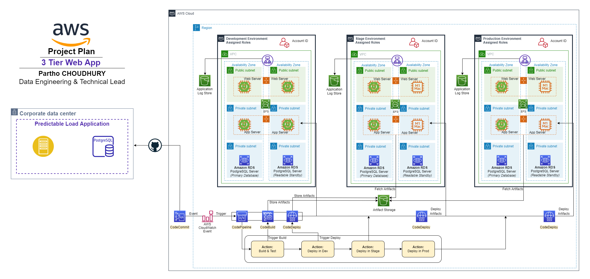

# **Deploy an application with a PostgreSQL Database on AWS within 3 Environments (Production, Staging, Development).** :computer: #

In the DevOps world, we sometimes struggle with terminology.

Note: A stage is a stack that you deploy for a specific purpose.

Stages are used in code pipelines to provide an on-ramp to push code changes from smaller to wider audiences. For example, a change will typically start with a dev stage (either a team or a personal dev stack). If the change works on the dev stage, a team may next push it to a test stage where internal stakeholders can access it, followed by a staging stage where it's available to a limited number of external customers. Finally, if the change passes all automated and manual tests, it'll be pushed to the production stage.

Stages can also be referred to as "environments" - for example, the dev environment, test environment, etc.

## > :rocket: **Thank you for your interest in my work.** :blush: ##

Using this solution, you can easily set up and manage an entire CI/CD pipeline in AWS accounts using the native AWS suite of CI/CD services, where a commit or change to code passes through various automated stage gates all the way from building and testing to deploying applications, from development to production environments.

The project is supported by several managed services including **Amazon Route 53**, **Amazon CloudFront**, **AWS WAF**, **Elastic Load Balancing (ELB)**, **AWS Shield**, **Amazon ElastiCache**, **Amazon RDS**, **Amazon S3**, etc.

## **Full Production, Staging and Dev environments on AWS with Kubernetes and RDS** :pager: ##

This example will show how to deploy a containerized app (Strapi) with PostgreSQL on AWS in Development, Staging and Production and makes it accessible via HTTPS. All of that in just a few lines of Terraform file.

```tr
resource "droplets_aws_credentials" "my_aws_creds" {
  organization_id   = var.droplets_organization_id
  name              = "URL Shortener"
  access_key_id     = var.aws_access_key_id
  secret_access_key = var.aws_secret_access_key
}

resource "droplets_cluster" "production_cluster" {
  organization_id   = var.droplets_organization_id
  credentials_id    = droplets_aws_credentials.my_aws_creds.id
  name              = "Production cluster"
  description       = "Terraform prod demo cluster"
  cloud_provider    = "AWS"
  region            = "eu-central-1"
  instance_type     = "T3A_MEDIUM"
  min_running_nodes = 3
  max_running_nodes = 4
  state             = "RUNNING"

  depends_on = [
    droplets_aws_credentials.my_aws_creds
  ]
}

resource "droplets_cluster" "staging_cluster" {
  organization_id   = var.droplets_organization_id
  credentials_id    = droplets_aws_credentials.my_aws_creds.id
  name              = "Staging cluster"
  description       = "Terraform staging demo cluster"
  cloud_provider    = "AWS"
  region            = "eu-central-1"
  instance_type     = "T3A_MEDIUM"
  min_running_nodes = 3
  max_running_nodes = 4
  state             = "RUNNING"

  depends_on = [
    droplets_aws_credentials.my_aws_creds
  ]
}

resource "droplets_cluster" "dev_cluster" {
  organization_id   = var.droplets_organization_id
  credentials_id    = droplets_aws_credentials.my_aws_creds.id
  name              = "Dev cluster"
  description       = "Terraform dev demo cluster"
  cloud_provider    = "AWS"
  region            = "eu-central-1"
  instance_type     = "T3A_MEDIUM"
  min_running_nodes = 3
  max_running_nodes = 4
  state             = "RUNNING"

  depends_on = [
    droplets_aws_credentials.my_aws_creds
  ]
}


resource "droplets_project" "my_project" {
  organization_id = var.droplets_organization_id
  name            = "Multi-env Project"

  depends_on = [
    droplets_cluster.production_cluster
  ]
}

resource "droplets_environment" "production" {
  project_id = droplets_project.my_project.id
  name       = "production"
  mode       = "PRODUCTION"
  cluster_id = droplets_cluster.production_cluster.id

  depends_on = [
    droplets_project.my_project
  ]
}

resource "droplets_database" "production_psql_database" {
  environment_id = droplets_environment.production.id
  name           = "strapi db"
  type           = "POSTGRESQL"
  version        = "13"
  mode           = "MANAGED" # Use AWS RDS for PostgreSQL (backup and PITR automatically configured by droplets)
  storage        = 10 # 10GB of storage
  accessibility  = "PRIVATE" # do not make it publicly accessible
  state          = "RUNNING"

  depends_on = [
    droplets_environment.production,
  ]
}

resource "droplets_application" "production_strapi_app" {
  environment_id = droplets_environment.production.id
  name           = "strapi app"
  cpu            = 1000
  memory         = 512
  state          = "RUNNING"
  git_repository = {
    url       = "https://github.com/ianthropos88/awscloud_web_app_Ch.4"
    branch    = "main"
    root_path = "/"
  }
  build_mode            = "DOCKER"
  dockerfile_path       = "Dockerfile"
  min_running_instances = 1
  max_running_instances = 1
  ports                 = [
    {
      internal_port       = 1337
      external_port       = 443
      protocol            = "HTTP"
      publicly_accessible = true
    }
  ]
  environment_variables = [
    {
      key   = "PORT"
      value = "1337"
    },
    {
      key   = "HOST"
      value = "0.0.0.0"
    },
    {
      key   = "DATABASE_HOST"
      value = droplets_database.production_psql_database.internal_host
    },
    {
      key   = "DATABASE_PORT"
      value = droplets_database.production_psql_database.port
    },
    {
      key   = "DATABASE_USERNAME"
      value = droplets_database.production_psql_database.login
    },
    {
      key   = "DATABASE_NAME"
      value = "postgres"
    },
  ]
  secrets = [
    {
      key   = "ADMIN_JWT_SECRET"
      value = var.strapi_admin_jwt_secret
    },
    {
      key   = "API_TOKEN_SALT"
      value = var.strapi_api_token_salt
    },
    {
      key   = "APP_KEYS"
      value = var.strapi_app_keys
    },
    {
      key   = "DATABASE_PASSWORD"
      value = droplets_database.production_psql_database.password
    }
  ]

  depends_on = [
    droplets_environment.production,
    droplets_database.production_psql_database,
  ]
}
```

### **Behind the Scene** ###

1. Creates 3 Kubernetes clusters (`Dev`, `Staging`, `Production`) on the AWS account (VPC, Security Groups, Subnet, EKS/Kubernetes...).
2. Creates resources:
   - Organization `Terraform Demo`
   - Project `Strapi V4`
   - Environment `production`
   - Database `strapi db` (RDS) for `Production`
   - Application `strapi app` for `Production`
   - Environment `staging`
   - Database `strapi db` (RDS) for `Staging`
   - Application `strapi app` for `Staging`
   - Environment `dev`
   - Database `strapi db` (Container with EBS) for `Dev`
   - Application `strapi app` for `Dev`
   - Inject all the Secrets and Environment Variables used by the app for every environment
3. Builds `strapi app` application for `Production`, `Staging` and `Dev` environments in parallel.
4. Pushes `strapi app` container image in the ECR registry  for `Production`, `Staging` and `Dev` environments in parallel.
5. Deploys your PostgreSQL database for `Production` (AWS RDS), `Staging` (AWS RDS) and `Dev` (Container) environments in parallel.
6. Deploys `strapi app` on your `Production`, `Staging` and `Dev` EKS clusters.
7. Creates an AWS Network Load Balancer for all your clusters and apps.
8. Generates a TLS certificate for your app for all your apps.
9. Exposes publicly via HTTPS your Strapi app from `Production`, `Staging` and `Dev` through different endpoints.

It takes approximately **20 minutes to create the infrastructure** and **less than 10 minutes to deploy the application** for each environment. 

### **AWS services** ###

**This solution uses the following AWS services:**

1. **AWS CodeCommit** – A fully-managed source control service that hosts secure Git-based repositories. CodeCommit makes it easy for teams to collaborate on code in a secure and highly scalable ecosystem. This solution uses CodeCommit to create a repository to store the application and deployment codes.
2. **AWS CodeBuild** – A fully managed continuous integration service that compiles source code, runs tests, and produces software packages that are ready to deploy, on a dynamically created build server. This solution uses CodeBuild to build and test the code, which we deploy later.
3. **AWS CodeDeploy** – A fully managed deployment service that automates software deployments to a variety of compute services such as Amazon EC2, AWS Fargate, AWS Lambda, and your on-premises servers. This solution uses CodeDeploy to deploy the code or application onto a set of EC2 instances running CodeDeploy agents.
4. **AWS CodePipeline** – A fully managed continuous delivery service that helps you automate your release pipelines for fast and reliable application and infrastructure updates. This solution uses CodePipeline to create an end-to-end pipeline that fetches the application code from CodeCommit, builds and tests using CodeBuild, and finally deploys using CodeDeploy.
5. **AWS CloudWatch Events** – An AWS CloudWatch Events rule is created to trigger the CodePipeline on a Git commit to the CodeCommit repository.
Amazon Simple Storage Service (Amazon S3) – An object storage service that offers industry-leading scalability, data availability, security, and performance. This solution uses an S3 bucket to store the build and deployment artifacts created during the pipeline run.
6. **AWS Key Management Service (AWS KMS)** – AWS KMS makes it easy for you to create and manage cryptographic keys and control their use across a wide range of AWS services and in your applications. This solution uses AWS KMS to make sure that the build and deployment artifacts stored on the S3 bucket are encrypted at rest.

### **Overview of solution** ###

This solution uses three separate AWS accounts: a development account (1111), a stage account, and a production account (2222) in Region eu-central-1.

We use the development account to deploy and set up the CI/CD pipeline, along with the source code repository. It also builds and tests the code locally and performs a test deploy.

The production account is any other account where the application is required to be deployed from the pipeline in the dev account.

**In summary, the solution has the following workflow:**

1. A change or commit to the code in the CodeCommit application repository triggers CodePipeline with the help of a CloudWatch event.

2. The pipeline downloads the code from the CodeCommit repository, initiates the Build and Test action using CodeBuild, and securely saves the built artifact in the S3 bucket.

3. If the preceding step is successful, the pipeline triggers the Deploy in Development action using CodeDeploy and deploys the app in development account.

4. If successful, the pipeline triggers the Deploy in Staging action using CodeDeploy and deploys the app in the Staging account. Also, once successful, the pipeline triggers the Deploy in Production action using CodeDeploy and deploys the app in the Production account.

The following diagram illustrates the workflow:

<p align="center">
  
</p>
<p align="center"><b>Scenario:</b> The Architecture Design - 3 Tier within 3 Environments (Development, Stage and Production).</p>

**Failsafe deployments**

This example of CodeDeploy uses the IN_PLACE type of deployment. However, to minimize the downtime, CodeDeploy inherently supports multiple deployment strategies. This example makes use of following features: rolling deployments and automatic rollback.

CodeDeploy provides the following three predefined deployment configurations, to minimize the impact during application upgrades:

1. **CodeDeployDefault.OneAtATime** – Deploys the application revision to only one instance at a time.
2. **CodeDeployDefault.HalfAtATime** – Deploys to up to half of the instances at a time (with fractions rounded down).
3. **CodeDeployDefault.AllAtOnce** – Attempts to deploy an application revision to as many instances as possible at once.

For OneAtATime and HalfAtATime, CodeDeploy monitors and evaluates instance health during the deployment and only proceeds to the next instance or next half if the previous deployment is healthy. For more information, see Working with deployment configurations in CodeDeploy.

You can also configure a deployment group or deployment to automatically roll back when a deployment fails or when a monitoring threshold you specify is met. In this case, the last known good version of an application revision is automatically redeployed after a failure with the new application version.

**How CodePipeline in the dev account deploys apps in the prod account?**

In this post, the deployment pipeline using CodePipeline is set up in the dev account, but it has permissions to deploy the application in the staging and prod account. We create a special cross-account role in the prod account, which has the following:

1. Permission to use fetch artifacts (app) rom Amazon S3 and deploy it locally in the account using CodeDeploy.
2. Trust with the dev account where the pipeline runs.

CodePipeline in the dev account assumes this cross-account role in the prod account to deploy the app.

**Setting up the prod account**

To set up the prod account, complete the following steps:

1. Download and launch the AWS CloudFormation template from the GitHub repo: cicd-codedeploy-prod.json
    - This deploys the CodeDeploy app and deployment group.
    - Make sure that you already have a set of EC2 Linux instances with the CodeDeploy agent installed in all the accounts where the sample Java application is to be installed (dev and prod accounts). If not, refer back to the Prerequisites section.
2. Update the existing EC2 IAM instance profile (cicd_ec2_instance_profile):
    - Replace the S3 bucket name mywebapp-codepipeline-bucket-eu-central-1-1111 with your S3 bucket name (the one used for the CodePipelineArtifactS3Bucket variable when you launched the CloudFormation template in the dev account).
    - Replace the KMS key ARN arn:aws:kms:eu-central-1:1111:key/82215457-e360-47fc-87dc-a04681c91ce1 with your KMS key ARN (the one created as part of the CloudFormation template launch in the dev account).
    
**Setting up the dev account**

To set up your dev account, complete the following steps:

1. Download and launch the CloudFormation template from the GitHub repo: cicd-aws-code-suite-dev.json
The stack deploys the following services in the dev account:
    - CodeCommit repository
    - CodePipeline
    - CodeBuild environment
    - CodeDeploy app and deployment group
    - CloudWatch event rule
    - KMS key (used to encrypt the S3 bucket)
    - S3 bucket and bucket policy
2. You should have created all the existing resources and roles beforehand as part of the prerequisites.
- It should take 5–10 minutes for the CloudFormation stack to complete. When the stack is complete, you can see that CodePipeline has built the pipeline (MyWebAppPipeline) with the CodeCommit repository and CodeBuild environment, along with actions for CodeDeploy in local (dev) and cross-accounts (staging & prod). CodePipeline should be in a failed state because your CodeCommit repository is empty initially.
3. Update the existing Amazon EC2 IAM instance profile (cicd_ec2_instance_profile):
    - Replace the S3 bucket name mywebapp-codepipeline-bucket-eu-central-1-1111 with your S3 bucket name (the one used for the CodePipelineArtifactS3Bucket parameter when launching the CloudFormation template in the dev account).
    - Replace the KMS key ARN arn:aws:kms:eu-central-1:1111:key/82215457-e360-47fc-87dc-a04681c91ce1 with your KMS key ARN (the one created as part of the CloudFormation template launch in the dev account).
    
**Deploying the application**

You’re now ready to deploy the application via your desktop or PC.

1. Assuming you have the required HTTPS Git credentials for CodeCommit as part of the prerequisites, clone the CodeCommit repo that you created earlier as part of the dev account setup. Obtain the name of the CodeCommit repo to clone, from the CodeCommit console. Enter the Git user name and password when prompted. For example:

```git
$ git clone https://git-codecommit.eu-central-1.amazonaws.com/v1/repos/MyWebAppRepo my-web-app-repo
Cloning into 'my-web-app-repo'...
Username for 'https://git-codecommit.eu-central-1.amazonaws.com/v1/repos/MyWebAppRepo': xxxx
Password for 'https://xxxx@git-codecommit.eu-central-1.amazonaws.com/v1/repos/MyWebAppRepo': xxxx
```
2. Download the MyWebAppRepo.zip file containing a sample Java application, CodeBuild configuration to build the app, and CodeDeploy config file to deploy the app.
3. Copy and unzip the file into the my-web-app-repo Git repository folder created earlier.
4. Assuming this is the sample app to be deployed, commit these changes to the Git repo. For example:

```git
$ cd my-web-app-repo 
$ git add -A 
$ git commit -m "initial commit" 
$ git push
```
After you commit the code, the CodePipeline will be triggered and all the stages and your application should be built, tested, and deployed all the way to the production environment!

**Cleaning up**

To avoid incurring future charges or to remove any unwanted resources, delete the following:

- EC2 instance used to deploy the application
- CloudFormation template to remove all AWS resources created through this post
- IAM users or roles

**FAQs**

In this section, I answered some frequently asked questions:

1. Can I expand this deployment to more than two accounts?
- Yes. You can deploy a pipeline in a tooling account and use dev, non-prod, and prod accounts to deploy code on EC2 instances via CodeDeploy. Changes are required to the templates and policies accordingly.
2. Can I ensure the application isn’t automatically deployed in the prod account via CodePipeline and needs manual approval?
- Yes. Minor changes are required to the CodePipeline section of the CloudFormation template for the dev environment to add an Approval stage and action.
3. Can I use a CodeDeploy group with an Auto Scaling group?
- Yes. Minor changes required to the CodeDeploy group creation process.
4. Can I use this pattern for EC2 Windows instances?
- Not as is. You need to make a few changes to the CloudFormation template for the dev environment for a CodeBuild project. For more information about setting up a CodeBuild environment, see Microsoft Windows samples for CodeBuild.

# About Me :sunglasses: #
- With 10+ years of industry experience, I have thrived in Data Science, Data Governance, IT, Cloud and Product Management. I have a keen interest and expertise in solving business problems using unique logic and analytics. I bring solutions to the table based on competitive Business Acumen and Human Intelligence.
- Have a look at my portfolio: [Helping organization level all their Seeds Business arguments using Data & Technology | Ex_Zalando | Ex_Freecharge | Ex_Myntra Jabong | Ex_Supercell | Ex_Infosys](https://www.linkedin.com/in/pnchoudhury/)
- I love talking about #cloudarchitecture, #businessanalytics, #datapipelines, #machinelearning, and #artificialintelligence
